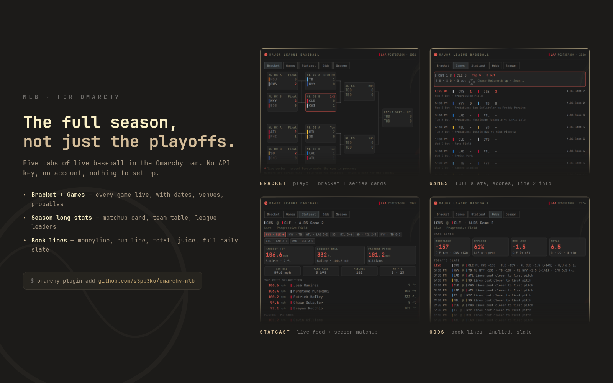

# MLB — Omarchy bar plugin



A tiny baseball pill for the [Omarchy](https://omarchy.org)
bar that turns into five tabs of live baseball: the playoff bracket, the full
game day schedule with dates and probables, season-long stats for every team,
the latest Statcast numbers for the game you are watching, and whoever's
close to first pitch from the books. Data from the MLB Stats API, Baseball
Savant, ESPN's public scoreboard, and the two major prediction markets.

No API key, no account, nothing to set up before it works.

## The five tabs

- **Bracket** — playoff bracket with series scores, colors, current state
  (TBD / live / final). When the run ends, the final WS card gets tucked into
  the same bracket page you know.
- **Games** — every game today and through the upcoming stretch, newest games
  with a focused detail card (live count, bases, last play, R-H-E for finals,
  probables for previews), dates and venues on a second line, and an accent
  stripe for games your favorite team plays.
- **Statcast** — matchup card: away/home full-season lines side by side, a
  30-team season table sorted by record, and league leaders for hitting &
  pitching. During a game, the top of the tab switches to current hardest
  hits, longest balls, fastest pitches, and exit-velo/pitch-speed boards from
  the same tracking feed as Baseball Savant.
- **Season** — the current season calendar and standings, season-at-a-glance today.
- **Odds** — for the focused game: moneyline, implied probability, run line
  and total with each side's juice. Beneath it, every non-final game on
  today's slate with its current line when ESPN has one. The World Series
  winner market from Polymarket and Kalshi closes off the tab.

## The bar pill

The pill shows what's most useful right now — live games (score only), the
next first pitch for your schedule, or the offseason/spring-training
countdown. Favorite-team games always route through it first when they exist.

## Installation

```bash
omarchy plugin add https://github.com/s3pp3ku/omarchy-mlb
```

Settings live on the widget in your bar (right-click): favorite team, default
tab, whether team colors are painted in tables, 12h/24h times, popup
position, notify-on-start, and the monthly odds budget.

## Data & network

Everything is fetched at a definable rhythm, cached on disk, and only polled
while a schedule refresh is due or the popup is open:

| Source | Used for | Cadence |
|---|---|---|
| `statsapi.mlb.com` | Schedule, live feed, standings/season/stat tables/leaders | open + 45s (live), 10 min otherwise |
| `site.api.espn.com` | Game odds | date-gated cache, refreshed on open/refresh, a month's worth budgeted |
| Polymarket + Kalshi gamma APIs | WS-winner price | same budget gate as ESPN |

Odds pulls are: (1) throttled to `oddsBudget` pulls per source per
calendar month (default 31 = roughly one a day), (2) TTL-cached for most of
that window, and (3) stale-served when capped. The budget footer in the Odds
tab shows the current cadence so you can tune it.

## Development

```bash
node tools/test-mlb.js      # unit tests for all parsers and selectors
tools/capture-preview.sh    # refresh assets/tabs/*.png (needs Hyprland running)
tools/build-preview.sh      # regenerate promo.html → preview.png
```

The QML modules hot-reload on save; a `node`-side test suite covers parsers,
odds formatting, selector ordering, bracket shape, and the ESPN-abbreviation
  boundary cases.

## License

MIT — see [LICENSE](LICENSE).

## A note from the author

I'm new to Omarchy plugin development and used AI assistance to help build
this widget. The idea was inspired by the community's Formula 1 bar plugin.
If you spot a bug, have a suggestion, or can help improve the QML or stats,
please open an issue or pull request — all help is welcome.
